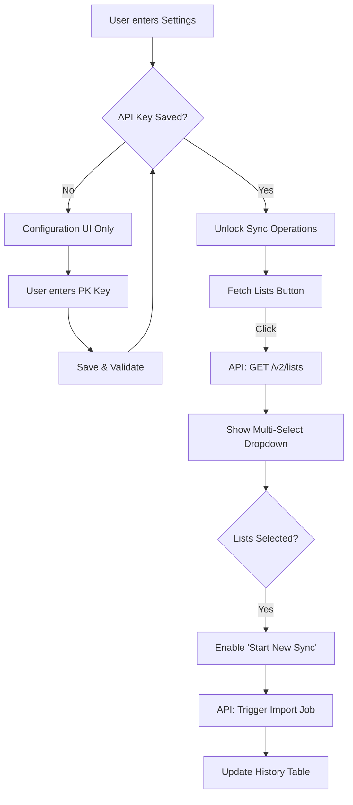

# Technical Requirements Document: Klaviyo Integration Module

## 1. Overview
The Klaviyo Integration module allows users to synchronize their marketing lists and profile data between Klaviyo and the Eva Conversion & Retention platform. This integration is accessible from two primary locations:
1. **Settings > Integrations**: For account-wide configuration and sync management.
2. **Lists > Import From Klaviyo**: For quick list importing and sync triggering.

---

## 2. Core Functional Requirements

### 2.1 Authentication & Configuration
- **Private API Key Input**: The system must accept a valid Klaviyo Private API Key (format: `pk_xxxxxxxx`).
- **Permission Requirements**: The key must have at least `Lists: Read` and `Profiles: Read` permissions.
- **State Persistence**: The key must be encrypted and saved securely. 
- **Interactive Gate**: All "Sync Operations" and "Sync History" components must remain **disabled** and physically locked (using a semi-transparent overlay) until a valid key is saved.

### 2.2 List Fetching Flow (The "Pre-Fetch" Step)
To ensure data accuracy, lists are not pre-loaded.
- **Fetch Action**: A "Fetch available lists" button is presented once the API key is verified.
- **Loading State**: Upon clicking, a 1.2s (simulated or real) loading state must be shown with a spinning icon and "Fetching lists..." text.
- **Success Reveal**: Once lists are fetched, the "Load" button is replaced by the custom multi-select UI.

### 2.3 Multi-List Synchronization
- **Selection UI**: Use a custom dropdown menu instead of a standard HTML select.
- **Multi-Select**: Users must be able to select **one or many** lists simultaneously.
- **Count Indicator**: The selection button should summarize the state (e.g., "Select lists...", "Newsletter | 1,240 profiles", or "3 lists selected").
- **Sync Trigger**: The "Start New Sync" button must remain **disabled** until at least one list is selected.

### 2.4 Sync Execution & History
- **Sync Logic**: Triggering a sync creates a background job that iterates through the selected list(s) and pulls profile data.
- **History Tracking**: Every sync operation must be recorded in the `History` table with:
    - **Date/Time**: Exact timestamp of initiation.
    - **Status**: (Success / In Progress / Failed).
    - **Metrics**: Total found profiles, Successfully Imported, and Failed count.

---

## 3. Screen Descriptions & UI Modules

### 3.1 Settings > Integrations Screen
- **Placement**: A dedicated tab within the Settings sidebar.
- **Header**: Large title "Klaviyo Integration" with a purple underline.
- **Section 1: Configuration**: 
    - Contains a "How to" guide for API keys.
    - Mono-spaced input field for Private API Key.
    - "Save Settings" button with emerald checkmark feedback.
- **Section 2: Sync Operations**: 
    - Locked behind a frosted glass overlay if API key is missing.
    - Contains the "Fetch Lists" button and subsequent Multi-Select menu.
    - Features a summaries count (Total Profiles).
- **Section 3: Sync History**: 
    - A clean data table below the operations section.
    - Columns: Date, Status (Success/Fail in badges), Total Items, Imported, Failed.

### 3.2 Lists > Main Listing Screen
- **Primary View**: A tabular list of all existing audience segments.
- **Import List Dropdown**: 
    - A branded button that toggles two options: "From File (.csv)" and "From Klaviyo".
- **Klaviyo Modal**:
    - A slide-in modal (center-fixed).
    - Replicates the logic of Section 1 & 2 from Settings but in a condensed, focused modal layout.
    - Includes a navigation link: "View full history in Settings".

### 3.3 Lists > Import From File (CSV) Modal
- **Upload Zone**: A large, dashed-border drag & drop area.
- **Validation**: 
    - Immediate visual feedback if a non-CSV file is dropped.
    - Display file name and size once staged.
- **Input Field**: A required "List Name" text input to define where contacts will be imported.
- **Action**: "Start Import" button that triggers a file streaming process to the backend.

---

## 4. Import from File (.csv) Logic
- **Streamlined Workflow**: Unlike the previous flow (Create List > Enter List > Import), the new workflow is **direct**.
- **Execution**: Clicking "From File (.csv)" in the main Lists screen opens the upload modal immediately.
- **Inputs**:
    1. **List Name**: User defines the name of the list to be created/updated.
    2. **File Selection**: User drops or selects the CSV file.
- **Processing**: Once the "Start Import" button is clicked, the system creates the list entry and processes the rows simultaneously.

---

## 5. UI/UX Specifications

---

## 5. API Endpoints (Planned)

### GET `/api/integrations/klaviyo/lists`
- **Request**: Headers containing Auth Token.
- **Response**: Array of objects: `{ id: string, name: string, count: number }`.

### POST `/api/integrations/klaviyo/sync`
- **Body**: `{ listIds: string[] }`
- **Response**: `{ jobId: string, estimatedTime: string }`

### GET `/api/integrations/klaviyo/history`
- **Response**: Array of historical sync objects.

---

## 6. Implementation Notes for Developers
- **Security**: Never expose the API Key in the frontend after initial entry. Use mask characters (e.g., `pk_****...`) if re-editing.
- **Animations**: Use Tailwind's `animate-in fade-in zoom-in-95` for revealing the list selector to provide a "premium" feel.
- **Overlay**: The locking overlay must have a `backdrop-blur-[1px]` and a high z-index relative to the sync container, but contained within that section.
